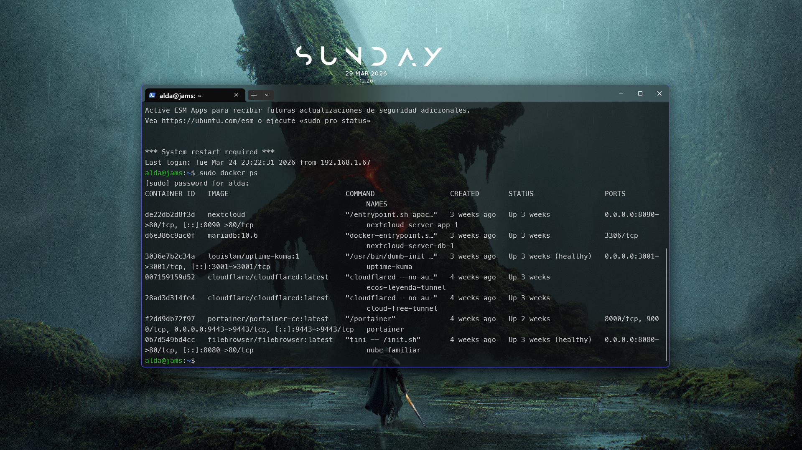
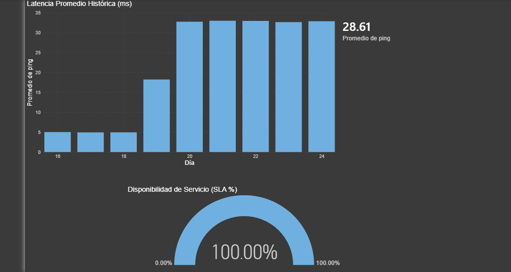

# Home Lab & Private Cloud Infrastructure
Este repositorio documenta la configuración, administración y despliegue de mi servidor doméstico basado en **Ubuntu Server**. El objetivo de este proyecto es gestionar servicios autohospedados, almacenamiento NAS y entornos de pruebas para mis desarrollos de software.

  

## Stack Tecnológico
* **OS:** Ubuntu Server 24.04 LTS
* **Virtualización/Contenedores:** Docker & Docker Compose
* **Redes y Seguridad:** Cloudflare Tunnels (Acceso Remoto Seguro), Wake-on-LAN
* **Servicios Principales:** Nextcloud (NAS), Portainer y Uptime Kuma (Monitoreo)
* **Visualización de Datos:** Power BI (Análisis de SLA y Latencia)

## Arquitectura de Servicios
Utilizo **Docker** para mantener un entorno limpio y aislado. Algunos de los contenedores activos son:

1. **Nextcloud:** Gestión de archivos y backup personal.
2. **Uptime Kuma:** Monitorización en tiempo real de la disponibilidad de mis servicios.
3. **Cloudflare Tunnel:** Exposición segura de servicios a internet sin abrir puertos en mi router local.

## Monitoreo y Análisis (Observabilidad)
Como parte de mi formación en Ingeniería de Software, implementé un flujo de datos para medir el rendimiento de mi servidor:
* **Extracción:** Exportación de datos desde Uptime Kuma.
* **ETL:** Limpieza y transformación de datos históricos.
* **Visualización:** Dashboard en **Power BI** para analizar el SLA (Service Level Agreement) y tiempos de respuesta (Latencia).

  

## Cómo lo administro
* **Acceso SSH:** Administración remota mediante terminal.
* **Automatización:** Se prevé el uso de scripts para backups periódicos y actualización de contenedores.
* **Energía:** Configuración de Wake-on-LAN para optimizar el consumo eléctrico del hardware.

---
📍 Desarrollado como parte de mi ecosistema de aprendizaje en Ingeniería en Software.
